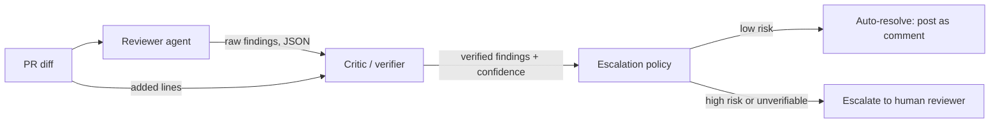

# pr-review-agent


**[Try it instantly →](https://eshanya1.github.io/pr-review-agent/)** — loads immediately, no build wait, replays all 15 real eval fixtures client-side with the actual diff, findings, and verifier decision from both the cassette and a validated live run (88.0% F1, reproduced identically 3 times).

[](https://mybinder.org/v2/gh/Eshanya1/pr-review-agent/main?urlpath=terminals/1)
— for the real CLI in a real terminal instead: no install, opens a real terminal with the tool already set up. Run `pr-review-agent eval` once it loads (takes ~1-2 min to build the first time).

A multi-agent system with two capabilities over the same repo: **PR review**
(reviewer agent → critic that verifies every claim against the diff →
escalation policy) and **RAG Q&A** (ask natural-language questions about the
codebase, answered only from retrieved chunks, cited). Both are wrapped in
the same guardrails (structured-output validation, prompt-injection
scanning) and the same self-built observability (latency, tokens,
estimated cost per call — no external account needed).

Zero setup to try the PR-review side: no API key, no database, no infra.
Clone it, install it, run `pr-review-agent eval`, and it replays 15
recorded review runs through the real critic/verification/escalation logic
and prints precision/recall/F1 on the spot.

```bash
git clone https://github.com/Eshanya1/pr-review-agent.git
cd pr-review-agent
python -m venv .venv && source .venv/bin/activate
pip install -e ".[dev]"
pr-review-agent eval
```

## Why a critic pass

The naive version of this project is "call an LLM, ask it to find bugs,
print what it says." That's fast to build and easy to fool — LLM reviewers
routinely invent a line number, misquote a variable name, or flag code that
isn't actually there. Shipping that straight to a human reviewer as if it
were fact is worse than not reviewing at all.

So the reviewer's output is never trusted directly. Every finding carries an
`evidence` field that must be an exact substring of a line the diff actually
adds. A second pass — the critic — mechanically checks that before anything
is surfaced or escalated:

- **Evidence found in the diff** → finding stays at full confidence, marked `verified`.
- **Evidence not found** (hallucinated, paraphrased, wrong file) → confidence is
  cut and the finding is marked unverified — but a high-severity finding that
  fails verification still triggers escalation. Not being able to confirm a
  claim about a critical bug is itself a reason to get a human involved, not
  a reason to drop it silently.

## Architecture



- **Reviewer agent** (`reviewer.py`) — produces structured findings from a diff.
  Two interchangeable backends:
  - `AnthropicBackend` — calls Claude for real, for arbitrary diffs (`--live`, needs `ANTHROPIC_API_KEY`).
  - `CassetteBackend` — replays a pre-recorded response for a known eval fixture.
    This is what makes the demo run with zero setup, and what makes eval
    scores reproducible instead of drifting every time a model is updated.
- **Critic** (`critic.py`) — verifies each finding's evidence against the
  diff's added lines (`diffparse.py`), and decides escalation.
- **Escalation policy** — only `high`/`critical` findings pull a human in;
  everything else auto-resolves. A finding that can't be verified is treated
  as high-risk by default, not discarded.
- **Eval harness** (`scoring.py` + `eval_data/`) — 15 hand-built fixtures (11 buggy
  across 9 bug classes, 4 clean) with ground-truth labels, scored for
  precision/recall/F1 and for whether the escalation decision itself was
  right.

## Eval results (recorded run, bundled cassettes)

```
$ pr-review-agent eval
fixtures             15
true_positives       9
false_negatives      2
false_positives      2
precision            0.818
recall               0.818
f1                   0.818
escalation_accuracy  1.0
auto_approve_rate    0.467
```

These are not cherry-picked to look perfect — the recorded run has two
real, intentional misses so the eval harness has something to actually
measure:

1. **`off_by_one_loop`** — a subtle low-severity off-by-one
   (`range(1, days)` instead of `range(0, days)`) that the recorded
   reviewer pass missed entirely. Counted as a false negative.
2. **`session_expiry`** — the reviewer *did* flag the missing TTL check, but
   paraphrased its evidence instead of quoting the diff verbatim. The critic
   correctly refuses to verify it — and because it's a `high`-severity claim,
   escalation still fires anyway (`escalation_accuracy` stays at 1.0), even
   though the finding doesn't count as a confirmed detection. This is the
   whole point of the critic: it makes "escalate when unsure" more robust
   than "trust the model's confidence," rather than trying to be a perfect
   filter.
3. **`clean_pagination_fix`** — a fixture that *correctly* fixes an
   off-by-one bug. The recorded run still flags the fix's ceiling-division
   expression as suspicious (a real, verifiable finding — it just quotes
   the diff correctly while being *wrong about the code being wrong*). Low
   severity, so it doesn't trigger escalation, but it does cost precision.
   The critic only catches hallucinated *evidence* — it can't catch a
   confidently-wrong *judgment*, and the eval numbers say so honestly.

Run `pr-review-agent eval --live` with `ANTHROPIC_API_KEY` set to regenerate
these against a live model instead of the recorded cassettes.

## Eval results (live run, real Claude API, `temperature=0`)

```
$ pr-review-agent eval --live
fixtures             15
true_positives       11
false_negatives      0
false_positives      3
precision            0.786
recall               1.0
f1                   0.880
escalation_accuracy  1.0
auto_approve_rate    0.467
```

Reproduced identically across 3 independent live runs — same 88.0% F1 every
time, despite `temperature=0` not guaranteeing bit-exact determinism on the
provider side. (An earlier single run of this same code recorded 91.7% F1;
that number doesn't reproduce anymore and has been retired in favor of this
validated one — see the [interactive demo](https://eshanya1.github.io/pr-review-agent/)
for the real diff/finding on every fixture.)

The live model still outperforms the recorded cassette on recall — it catches
both bugs (`off_by_one_loop`, `session_expiry`'s exact evidence) that the
hand-authored cassette is scripted to miss — but costs precision with three
low-severity false positives, one of which (`clean_pagination_fix`) is the
same confidently-wrong judgment call the cassette section above documents.
That's expected: the cassette exists for reproducibility, not to flatter the
system.

The 3 false positives here are the more interesting result, and all are
genuine, not fabricated for the demo — see them with full diffs on the
[interactive demo](https://eshanya1.github.io/pr-review-agent/):

- **`clean_pagination_fix`** flagged `start = page * page_size` as
  "off-by-one if page is 1-indexed" — speculative, and wrong for the code
  as written (0-indexed pages are standard), but not an unreasonable thing
  to ask a human to double-check. This one recurs across runs.
- **`clean_formatting_helpers`** flagged the already-fixed `truncate()`
  helper (`text[:max_len - 3] + "..."`) for still overflowing at very small
  `max_len` values — technically a real residual edge case for `max_len < 3`,
  though not one the fixture's own test suite exercises or the ground truth
  counts as a bug. Arguably a defensible flag, not a hallucination.
- **`clean_formatting_tests`** second-guessed the test file itself
  (`assert len(result) == 10`), reasoning the assertion should account for
  the ellipsis characters — a plausible-sounding but incorrect read of the
  test's actual assumptions.

**Live runs are not perfectly reproducible run-to-run**, even at
`temperature=0` (API-level nondeterminism across requests is documented
Claude/GPT behavior) — but the aggregate metrics above were identical across
3 independent runs, which is why they're reported as the current validated
baseline rather than a single lucky number. The specific false positives can
still vary run to run even when the F1 score doesn't; that variance is
exactly why the cassette-based eval, not the live one, is what CI checks on
every push.

## Bug classes covered by the eval set

| Category | Fixture | Severity |
|---|---|---|
| SQL injection | `sql_injection` | critical |
| Insecure deserialization (`pickle.loads` on untrusted input) | `insecure_deserialization` | critical |
| Shell injection | `shell_injection` | critical |
| Missing auth on a state-changing webhook | `missing_auth_webhook` | critical |
| PII written to logs | `pii_logging` | high |
| Session that never expires | `session_expiry` | high |
| TOCTOU race condition on inventory | `race_condition` | high |
| Path traversal via unsanitized filename | `path_traversal` | high |
| Off-by-one in a pagination slice | `off_by_one_pagination` | medium |
| Naive local time compared against UTC | `timezone_bug` | medium |
| Off-by-one in a loop bound | `off_by_one_loop` | low |
| 4 clean PRs (incl. one correct bugfix) | `clean_*` | — |

## Adding a new fixture

Fixtures, ground truth, and cassettes are generated from a single source of
truth so they can't drift out of sync:

```bash
python scripts/generate_fixtures.py
```

Add an entry to `FIXTURES` in that script (file path, code, expected
category/severity, and the findings a reviewer run actually produced) and
re-run it.

## Reviewing a real diff

```bash
export ANTHROPIC_API_KEY=sk-...
pr-review-agent review path/to/pr.diff --live
```

Prints the verified findings and the escalation decision as JSON; exits
non-zero if the PR was escalated, so it's usable as a CI gate.

## RAG over the repo


```bash
pip install -e ".[rag]"          # only this needs the heavier deps (sentence-transformers)
pr-review-agent rag index --path .
pr-review-agent rag ask "how does the critic decide whether to escalate a finding?"
```

- **Chunking is AST-aware, not fixed-window** (`rag/chunking.py`): Python
  files split at function/class boundaries via the `ast` module, so a chunk
  never cuts a function in half. Markdown splits by heading. Commit history
  is pulled from `git log`, one chunk per commit — questions like "what
  changed in the eval harness" are answered from real history, not guesses.
- **Embeddings are real and local** (`rag/embeddings.py`): `sentence-transformers`
  (`all-MiniLM-L6-v2`), computed on your machine, zero per-call cost. This
  is the one dependency worth gating behind an extra (`[rag]`) — it pulls in
  torch, which the core PR-review path has no reason to carry.
- **Vector store is embedded, not pgvector** (`rag/vectorstore.py`): brute-force
  cosine similarity over an in-memory NumPy array, persisted to disk. At the
  scale of one repo's chunks (hundreds, not millions) an ANN index would be
  premature, and this needs no hosted database, no account, no native SQLite
  extension to load (I tried `sqlite-vec` first — it needs SQLite's
  extension-loading enabled, which this machine's Python build doesn't have;
  rather than risk that being a "works on my laptop" trap again, NumPy won).
  Swapping in pgvector for real scale means implementing the same
  `build()`/`search()`/`save()`/`load()` interface against a server —
  nothing else in the pipeline changes.
- **Answers are grounded, not free-generated** (`rag/qa.py`): the model only
  sees retrieved chunks, must cite its sources, and is instructed to say
  "insufficient context" rather than guess. Structured output is validated
  against a pydantic schema before it's trusted (same guardrail as PR review).

### RAG eval results

Retrieval scoring is free and fully offline — it only needs the local
embedder, no API call:

```
$ pr-review-agent rag eval
questions              10
retrieval_hit_rate     0.9
retrieval_mrr          0.658
```

9/10 questions retrieved a relevant chunk in the top 5. The one miss (a
question about which env var enables live review) is a real retrieval gap,
not cherry-picked.

`--live` additionally generates real answers and has Claude judge whether
each one is actually grounded in what was retrieved (hand-rolled
LLM-as-judge rather than Ragas — same "own the metric" approach as the rest
of this project's eval harness, and Ragas' default judges assume an
OpenAI-shaped client anyway):

```
$ pr-review-agent rag eval --live
faithfulness_rate      0.8
faithfulness_n         10
```

Both misses are informative, not embarrassing:
- One answer was **correct but not traceably grounded** — the model named
  the right environment variable, but the judge couldn't find it in the
  chunks that were actually retrieved (the same question that missed on
  retrieval above). Right answer, wrong reason to trust it — exactly the
  gap a faithfulness check exists to catch.
- The **license question** lost a very short "## License\n\nMIT" chunk to
  competing, longer chunks in the top-k ranking. A real, minor weakness of
  short sections in section-based chunking, not a bug.

## Guardrails

- **Prompt-injection scanning** (`guardrails.py`) — a pattern-based tripwire
  ("ignore previous instructions", "reveal your system prompt", etc.) run
  against both diffs (PR review) and questions (RAG). It doesn't strip or
  alter the flagged text — stripping on a false positive would silently
  mutate legitimate content — it forces escalation / caps confidence
  instead. Documented honestly as a heuristic: a determined attacker can
  phrase around any fixed pattern list, so the system prompt also
  explicitly tells the model to treat all diff/context content as data,
  never instructions, as defense in depth.
- **Structured output enforcement** — `Finding` and the RAG answer schema
  are pydantic models, not trusted dicts. A malformed finding (bad enum
  value, missing field) is dropped with a warning instead of crashing the
  whole review or silently propagating garbage.
- **Confidence-based escalation** — already the core of the PR-review
  design (see "Why a critic pass" above); RAG reuses the same posture by
  refusing to answer past a similarity threshold instead of guessing.

## Observability

```bash
pr-review-agent stats
```

```
=== Stats: 5 calls, 0 errors, ~$0.0289 total ===

rag_ask      calls=   4 errors=  0 avg_latency=5992.4ms  ~$0.0264
review       calls=   1 errors=  0 avg_latency=3680.4ms  ~$0.0025
```

Self-built (`observability.py`), not wired to LangSmith — every `review` and
`rag ask` call is wrapped in a tracer that records latency and estimates
cost from token usage, appending one JSON line to
`~/.pr-review-agent/traces.jsonl`. No external account, no network call
needed to see your own cost/latency history. Cost estimates use a small
hardcoded per-model pricing table (`PRICING_PER_MILLION`), so treat them as
directional, not a bill.

## Scope

Built as a focused slice, not an attempt at everything an "AI code
intelligence platform" could be. Deliberately **not** included:
fine-tuning an open-weight model on this repo's style (needs GPU compute
this project didn't spend), and a deployed, always-on service (FastAPI +
Docker + job queue) — both real, sizable pieces of work with real ongoing
cost, left out on purpose rather than half-built.

## Project layout

```
src/pr_review_agent/
  diffparse.py       unified diff -> structured added lines
  findings.py        Finding / ReviewResult pydantic models
  reviewer.py        LLM backend (live Anthropic) + cassette replay backend
  critic.py          evidence verification + escalation policy
  scoring.py         precision/recall/F1 + escalation accuracy
  pipeline.py        wires reviewer -> critic -> result
  guardrails.py      prompt-injection scanning, shared by review + RAG
  observability.py   self-built request tracer + cost estimation
  cli.py             `review` / `eval` / `rag index|ask|eval` / `stats`
  rag/
    chunking.py      AST-aware Python chunks, section-aware markdown, git log
    embeddings.py    local sentence-transformers embedder ([rag] extra)
    vectorstore.py   NumPy brute-force cosine similarity, save/load
    qa.py            retrieval + grounded answer + schema validation
    eval_rag.py      retrieval hit-rate/MRR + LLM-judge faithfulness
  eval_data/         packaged with the wheel (see pyproject.toml package-data) so
    fixtures/<id>/{pr.diff, ground_truth.json}    eval works after a real `pip install`, not just an editable checkout
    cassettes/<id>.json       recorded reviewer output for that fixture
    rag_questions.json        hand-labeled question -> expected-source set
scripts/generate_fixtures.py   single source of truth for all of the above
tests/             pytest suite: parser, critic, scorer, guardrails, chunking, vectorstore, observability
```

## License

MIT
