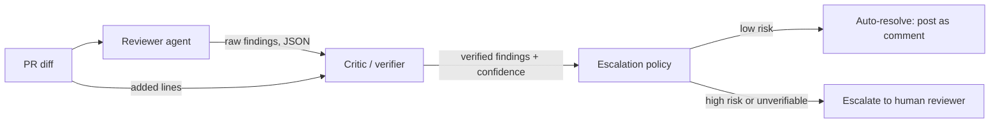

# pr-review-agent

A multi-agent system that reviews pull request diffs for security and
correctness bugs — with a **critic pass** that cross-checks every claim
against the actual diff before deciding whether a human needs to look at it.

Zero setup to try it: no API key, no database, no infra. Clone it, install
it, run `pr-review-agent eval`, and it replays 15 recorded review runs
through the real critic/verification/escalation logic and prints
precision/recall/F1 on the spot.

```bash
git clone https://github.com/<your-username>/pr-review-agent.git
cd pr-review-agent
python -m venv .venv && source .venv/bin/activate
pip install -e ".[dev]"
pr-review-agent eval
```

## Why a critic pass

The naive version of this project is "call an LLM, ask it to find bugs,
print what it says." That's fast to build and easy to fool — LLM reviewers
routinely invent a line number, misquote a variable name, or flag code that
isn't actually there. Shipping that straight to a human reviewer as if it
were fact is worse than not reviewing at all.

So the reviewer's output is never trusted directly. Every finding carries an
`evidence` field that must be an exact substring of a line the diff actually
adds. A second pass — the critic — mechanically checks that before anything
is surfaced or escalated:

- **Evidence found in the diff** → finding stays at full confidence, marked `verified`.
- **Evidence not found** (hallucinated, paraphrased, wrong file) → confidence is
  cut and the finding is marked unverified — but a high-severity finding that
  fails verification still triggers escalation. Not being able to confirm a
  claim about a critical bug is itself a reason to get a human involved, not
  a reason to drop it silently.

## Architecture



- **Reviewer agent** (`reviewer.py`) — produces structured findings from a diff.
  Two interchangeable backends:
  - `AnthropicBackend` — calls Claude for real, for arbitrary diffs (`--live`, needs `ANTHROPIC_API_KEY`).
  - `CassetteBackend` — replays a pre-recorded response for a known eval fixture.
    This is what makes the demo run with zero setup, and what makes eval
    scores reproducible instead of drifting every time a model is updated.
- **Critic** (`critic.py`) — verifies each finding's evidence against the
  diff's added lines (`diffparse.py`), and decides escalation.
- **Escalation policy** — only `high`/`critical` findings pull a human in;
  everything else auto-resolves. A finding that can't be verified is treated
  as high-risk by default, not discarded.
- **Eval harness** (`scoring.py` + `eval/`) — 15 hand-built fixtures (11 buggy
  across 9 bug classes, 4 clean) with ground-truth labels, scored for
  precision/recall/F1 and for whether the escalation decision itself was
  right.

## Eval results (recorded run, bundled cassettes)

```
$ pr-review-agent eval
fixtures             15
true_positives       9
false_negatives      2
false_positives      2
precision            0.818
recall               0.818
f1                   0.818
escalation_accuracy  1.0
auto_approve_rate    0.467
```

These are not cherry-picked to look perfect — the recorded run has two
real, intentional misses so the eval harness has something to actually
measure:

1. **`off_by_one_loop`** — a subtle low-severity off-by-one
   (`range(1, days)` instead of `range(0, days)`) that the recorded
   reviewer pass missed entirely. Counted as a false negative.
2. **`session_expiry`** — the reviewer *did* flag the missing TTL check, but
   paraphrased its evidence instead of quoting the diff verbatim. The critic
   correctly refuses to verify it — and because it's a `high`-severity claim,
   escalation still fires anyway (`escalation_accuracy` stays at 1.0), even
   though the finding doesn't count as a confirmed detection. This is the
   whole point of the critic: it makes "escalate when unsure" more robust
   than "trust the model's confidence," rather than trying to be a perfect
   filter.
3. **`clean_pagination_fix`** — a fixture that *correctly* fixes an
   off-by-one bug. The recorded run still flags the fix's ceiling-division
   expression as suspicious (a real, verifiable finding — it just quotes
   the diff correctly while being *wrong about the code being wrong*). Low
   severity, so it doesn't trigger escalation, but it does cost precision.
   The critic only catches hallucinated *evidence* — it can't catch a
   confidently-wrong *judgment*, and the eval numbers say so honestly.

Run `pr-review-agent eval --live` with `ANTHROPIC_API_KEY` set to regenerate
these against a live model instead of the recorded cassettes.

## Bug classes covered by the eval set

| Category | Fixture | Severity |
|---|---|---|
| SQL injection | `sql_injection` | critical |
| Insecure deserialization (`pickle.loads` on untrusted input) | `insecure_deserialization` | critical |
| Shell injection | `shell_injection` | critical |
| Missing auth on a state-changing webhook | `missing_auth_webhook` | critical |
| PII written to logs | `pii_logging` | high |
| Session that never expires | `session_expiry` | high |
| TOCTOU race condition on inventory | `race_condition` | high |
| Path traversal via unsanitized filename | `path_traversal` | high |
| Off-by-one in a pagination slice | `off_by_one_pagination` | medium |
| Naive local time compared against UTC | `timezone_bug` | medium |
| Off-by-one in a loop bound | `off_by_one_loop` | low |
| 4 clean PRs (incl. one correct bugfix) | `clean_*` | — |

## Adding a new fixture

Fixtures, ground truth, and cassettes are generated from a single source of
truth so they can't drift out of sync:

```bash
python scripts/generate_fixtures.py
```

Add an entry to `FIXTURES` in that script (file path, code, expected
category/severity, and the findings a reviewer run actually produced) and
re-run it.

## Reviewing a real diff

```bash
export ANTHROPIC_API_KEY=sk-...
pr-review-agent review path/to/pr.diff --live
```

Prints the verified findings and the escalation decision as JSON; exits
non-zero if the PR was escalated, so it's usable as a CI gate.

## Project layout

```
src/pr_review_agent/
  diffparse.py   unified diff -> structured added lines
  findings.py    Finding / ReviewResult data model
  reviewer.py    LLM backend (live Anthropic) + cassette replay backend
  critic.py      evidence verification + escalation policy
  scoring.py     precision/recall/F1 + escalation accuracy
  pipeline.py    wires reviewer -> critic -> result
  cli.py         `pr-review-agent review` / `pr-review-agent eval`
eval/
  fixtures/<id>/{pr.diff, ground_truth.json}
  cassettes/<id>.json      recorded reviewer output for that fixture
scripts/generate_fixtures.py   single source of truth for all of the above
tests/           pytest suite for the parser, critic, and scorer
```

## License

MIT
